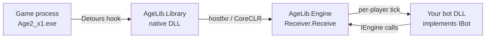

# AgeLib

AgeLib lets you write custom AI bots for **Age of Empires II: The Conquerors** (the WK/Voobly-style `Age2_x1.exe` build) in **.NET / C#**, running alongside — or instead of — the game's built-in AI scripting language.

It works by injecting a native DLL into the running game process, hooking the game's internal AI "run rule list" function, and forwarding each AI tick into a managed .NET engine. That engine exposes the game's per-player AI state (goals, strategic numbers, commands, facts, units, chat, etc.) through a simple C# interface, and dispatches the tick to whichever managed bot DLL is configured for each player.

## How it works



1. **Injection** — A native DLL (`AgeLib.Library`) is injected into the game process (e.g. via [Reloaded.Injector](https://github.com/Reloaded-Project/Reloaded.Injector)) and its exported `Initialize` function is invoked.
2. **Hooking** — `AgeLib.Library` is a C# project compiled with **Native AOT** into a native shared library (`NativeLib=Shared`). It links against [Detours](https://github.com/microsoft/Detours) (via vcpkg, as a static lib) and uses it, through `[UnmanagedCallersOnly]` function pointers, to hook the game's internal AI rule-list and get-string functions. On every AI tick for every player, the hook captures pointers to the live AI expert/game/custom-string state.
3. **Managed hosting** — `AgeLib.Library` hosts a *second*, separate CoreCLR runtime directly via `hostfxr` (its own AOT runtime cannot run arbitrary managed assemblies) and binds to a single managed entry point, `AgeLib.Engine.Receiver.Receive(int version, IntPtr config)`, exported from `AgeLib.Engine` via `[UnmanagedCallersOnly]`.
4. **Engine dispatch** — `Receiver` detects new games (reloading `agelib-engine.config`), figures out which player the current call belongs to, and calls `bot.Update(engine)` on the `IBot` configured for that player.
5. **Bot logic** — Your bot implements `IBot.Update(IEngine engine)` and uses the `IEngine` API to read/write goals, strategic numbers, facts, and unit data, and to issue chat/commands, exactly as an in-game AI script would.

## Project layout

| Project | Purpose |
|---|---|
| `AgeLib.Library` | C# project published with Native AOT to a native shared library (win-x86). Installs the Detours hook, hosts a separate CoreCLR via hostfxr, and forwards ticks into `AgeLib.Engine.Receiver.Receive`. Win32/x86 only (matches the game's process architecture). |
| `AgeLib.Engine` | Managed engine. `Receiver` is the native entry point; `EngineBase`/`Engine15` (in `UP15/`) adapt the game's live AI expert state (version 15 only, via reflection over hard-coded native offsets/structs) to the `IEngine` interface; `Loader` loads bot assemblies in isolated `AssemblyLoadContext`s. |
| `AgeLib.Common` | Shared enums (`Enums/`) and value types (`Types/`: `Cost`, `Point`, `SearchState`) used by both the engine and bots. |
| `Deimos` | Sample bot implementing `IBot`, showing map/town/unit/production tracking against the `IEngine` API. |
| `ConsoleApp1` | Local dev harness: copies the built library/engine into a game folder, launches the game, injects the DLL, and writes `agelib-engine.config`. |
| `AgeLib.Common.Tests`, `AgeLib.Engine.Tests` | Unit tests (xunit.v3). |

## Writing a bot

1. Create a class library referencing `AgeLib.Engine` (for `IBot`/`IEngine`) and `AgeLib.Common` (for enums/types).
2. Implement `IBot` with a **public parameterless constructor**:

   ```csharp
   using AgeLib.Engine;

   public class MyBot : IBot
   {
       public void Update(IEngine engine)
       {
           engine.ChatToAll("Hello from my bot!");
           engine.SetStrategicNumber(StrategicNumber.SomeNumber, 1);
       }
   }
   ```

   Your assembly must contain exactly one type implementing `IBot`.
3. Build the bot to a DLL.

## Configuring which bot runs for which player

At the start of each new game, `Receiver` reads `agelib-engine.config` from the game's process directory. This is a JSON object mapping player number (1-8) to the absolute path of the bot DLL to load for that player:

```json
{
  "1": "C:\\Path\\To\\MyBot.dll"
}
```

Bot assemblies are loaded once per unique path (cached by `Loader`) in their own `AssemblyLoadContext`, resolving dependencies alongside the bot DLL while sharing the `AgeLib.Engine`/`AgeLib.Common` types with the host.

## Running it locally

`ConsoleApp1` is the reference harness for local development:

1. Builds/copies `AgeLib.Library` (native dist output) and `AgeLib.Engine` (managed build output) into the game's folder.
2. Starts the game process (`WK.exe`) and waits for it to become idle.
3. Injects `AgeLib.Library.dll` and calls its exported `Initialize` function.
4. Writes `agelib-engine.config`, wiring player 1 to the sample `Deimos` bot.

Update the hard-coded paths at the top of [ConsoleApp1/Program.cs](ConsoleApp1/Program.cs) to point at your own game install and build output before running it.

## The `IEngine` API

`IEngine` (see [AgeLib.Engine/IEngine.cs](AgeLib.Engine/IEngine.cs)) is the surface bots use to interact with the game's AI system, mirroring the classic AI scripting language's primitives:

- **Strategic numbers / goals** — `GetStrategicNumber`/`SetStrategicNumber` (by `int` or `StrategicNumber` enum), `GetGoal`/`SetGoal`, plus typed helpers for goal ranges that encode a `Point`, `Cost`, or `SearchState`.
- **Commands & conditions** — `Execute(name, args...)` runs a named AI command and returns its result; `Check(name, args...)` treats the result as a boolean condition.
- **Symbols** — `GetSymbols()`/`IsSymbolDefined(symbol)` inspect custom-string-defined symbols known to the AI.
- **Chat** — `ChatToAll`/`ChatToPlayer` and data-carrying variants.
- **World queries** — `GetFact(player, FactId, parameter)`, `GetObjectData(ObjectData)`, `FindUnits(player, ObjectStatus, ObjectList, ids)`.
- **Logging** — `Log(message)` writes to the engine's log file.

`MyPlayer` reports which player number the current tick belongs to.

## Requirements & limitations

- Windows only; targets the Win32/x86 build of the game (`Age2_x1.exe`).
- Only game/AI version **15** is currently supported by the engine's version selector.
- Bot DLLs and `agelib-engine.config` are resolved relative to the game process's working directory.
- Bot assemblies need a public, parameterless-constructible type implementing `IBot`.

## Building

- Requires the .NET SDK version pinned in [global.json](global.json), and a Visual Studio C++ toolset with vcpkg for the Detours dependency (needed to link `AgeLib.Library`, even though it's C#).
- Managed projects (`AgeLib.Engine`, `AgeLib.Common`, bots, tests) build with the standard `dotnet build`.
- `AgeLib.Library` is a Native AOT project (`PublishAot`, `RuntimeIdentifier=win-x86`); build its native output with `dotnet publish`, not `dotnet build`. Output goes to `AgeLib.Library/dist/<Configuration>`.
- Tests use xunit.v3 with the Microsoft.Testing.Platform runner (opted in via `global.json`); run with `dotnet test --project <csproj>` rather than plain `dotnet test <csproj>`.